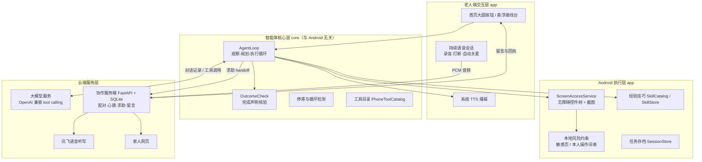
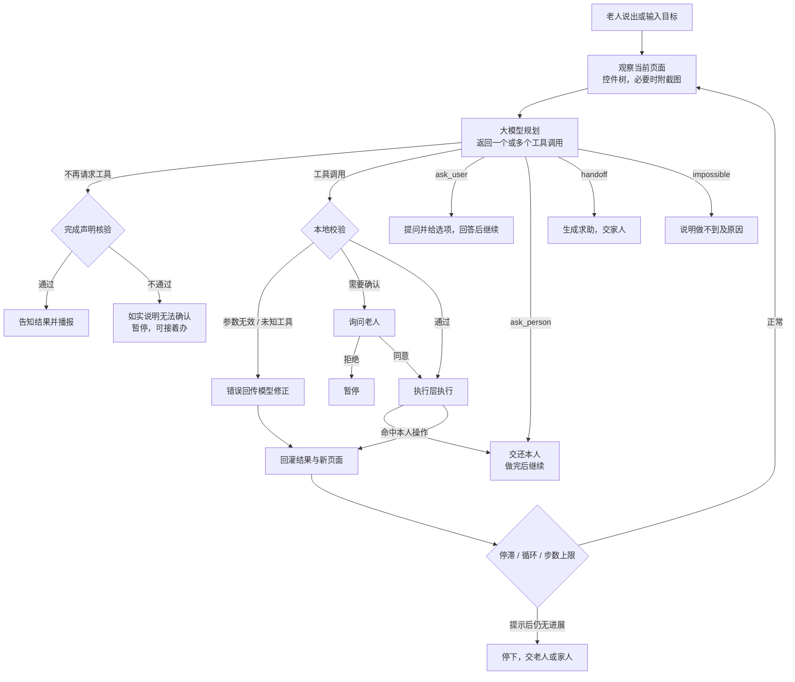

<!--
初稿说明（排版前删除本段）
- 结构：模板的“作品简介 / 一、项目概述”保留，其后按 2026 AIC「AI+软件创新」技术方案参考大纲展开。
- 标记：【待补】= 需团队补充的信息或数据；【交稿前更新】= 取决于严重问题修复结果、修完后改写。
- 状态措辞：已实现 / 原型验证（小样本真机）/ 拟研发，三类严格区分，不把计划写成成果。
- 匿名：全文不出现学校名称、Logo、指导教师。
- 图：先用 Mermaid 草拟，排版时转成图片。
-->

# 2026年第八届全球校园人工智能算法精英大赛 · 算法创新赛

## AI+软件创新 技术报告

- 团队名称：能工智人
- 参赛编号：AIC-2026-86471901
- 作品名称：银龄智办——可信跨应用助老智能体
- 日期：【待补】2026年x月xx日

---

## 作品简介

<!-- 约 290 字，≤300 字；按“问题—方案—效果—应用”组织。定稿后用字数统计复核。 -->

老年人用手机办事，常卡在步骤繁琐、误触有风险、不会时找不到人帮忙。“银龄智办”是面向老年人的多模态跨应用手机智能体：老人说出需求，系统融合语音交互、屏幕截图与无障碍控件解析，由大模型规划并调用本地工具跨应用操作，完成查车票、查快递、填写消息、调整字号等事务。付款、发送、验证码等关键步骤交还本人完成；完成声明经机械一致性核验，不能确认时如实说明；遇到困难可生成含目标与卡点的求助，由家人在网页认领并回话。安卓原型已在真机完成 12306 查票、拼多多查快递、美团点餐至结算交接等任务。后续将研究任务证据核验、分级自主执行与验证驱动的技能自进化，帮助老人安全、便捷地使用数字服务。

---

## 一、项目概述

### （一）项目背景与意义

#### 1. 老年人手机办事的现实困难

出行购票、快递物流、生活缴费、就医挂号等服务大量转到手机应用中完成，老年人常遇到三类困难：

- **步骤多、界面变化快**：一件事往往要跨两三个应用、十几步操作，页面改版后原来记住的路径就会失效。
- **误触后果难以承担**：付款、下单、发送等操作不可撤销，老人对“点了会怎样”缺少把握，要么不敢点，要么点错。
- **求助不便**：子女不在身边时，远程电话只能口头指导；远程控制或屏幕共享又恰好是电信诈骗的常见手法。

【待补：引用权威统计数据，例如国家统计局或 CNNIC 关于 60 岁及以上网民规模、老年人数字技能的公开数据，注明出处与年份。】

#### 2. 现有方案的不足

| 方案 | 能做到的 | 不足 |
|---|---|---|
| 应用适老化（大字版、关怀模式） | 放大字号、简化界面 | 只改单个应用，跨应用的流程仍靠老人自己完成 |
| 手机厂商语音助手 | 打开应用、设闹钟、查天气等系统级指令 | 难以深入第三方应用内部完成多步事务 |
| 子女远程指导或远程控制 | 能解决具体问题 | 依赖子女时间；远程控制与诈骗手法难以区分 |
| 通用手机 GUI 智能体 | 能在任意应用中执行多步操作 | 主要面向一般用户，较少把关键操作交还本人、说明结果能否确认、衔接真人求助作为设计约束 |

#### 3. 项目意义

本项目让老人用现有手机、用一句话发起办事，由智能体跨应用完成可以代劳的部分，把关键决定留给本人，把办不成的事交给信得过的人。技术上，项目研究的重点不是训练新的基础模型，而是**让大模型在手机上的行动有约束、结果可核验、失败有去处**的执行框架，这也是通用智能体进入老年人日常使用前必须补齐的环节。

### （二）赛题方向定位

本作品申报 **AI+软件创新** 赛题，属于赛题作品范围中的“智能体”与“移动端 AI 应用程序”。作品是可安装的 Android 应用加配套服务端：

- **AI 与产品的结合点**：大模型负责理解口语目标和逐步规划；自研部分是观察—规划—执行循环、多模态页面观察、本地风险约束、完成声明核验、技能按需加载与生成，以及亲友协作链路。
- **外部能力如实标注**：规划使用兼容 OpenAI Chat Completions 接口、支持 tool calling 的大模型服务（真机测试使用 `deepseek-chat`）；语音识别使用讯飞语音听写云服务；语音播报使用系统 TTS。本项目不声称上述模型或服务为自研。

---

## 二、产品定位与目标

### （一）产品类型与目标用户

- **产品类型**：AI 智能体类移动应用（Android）与配套协作服务端（Web）。
- **主要用户**：能使用智能手机基础功能，但在多步操作、跨应用事务上有困难的老年人。
- **协作用户**：家人、社区网格员、邻居。他们通过配对码加入老人的“可信圈子”，用浏览器查看求助、认领并回话，不需要安装应用。

### （二）核心功能

| 功能 | 老人看到的 | 状态 |
|---|---|---|
| 一句话办事 | 首页一个大圆按钮，点一下开始对话，说完自动识别；也可以打字 | 已实现 |
| 跨应用代操作 | 智能体在第三方应用里点按、输入、滚动、返回，每一步都念出来 | 已实现 |
| 关键操作交还本人 | 到付款、发送、验证码等步骤时停下，说明要点哪里，老人做完点“我做好了，继续” | 已实现，执行路径覆盖不全，见第五部分 |
| 追问与续办 | 目标不清楚时提问并给出按钮选项；暂停后从原来的进度继续 | 已实现（进程内续办） |
| 完成声明核验 | 声称办成但与本轮操作记录对不上时，改说“我没法确认这件事真的办成了” | 已实现（机械层） |
| 找家人 | 生成含目标与卡点的求助，家人网页认领；也可以生成短信草稿、拨号 | 已实现 |
| 亲友留言 | 家人的留言和认领回执在老人手机上以大字卡片显示并朗读 | 已实现 |
| 经验技巧 | 针对表格、盲页面、微信输入等难点的按需技巧；成功任务经老人确认后可生成候选技巧，家人采用或回退 | 静态技巧已实现；生成链路为原型 |

### （三）差异化优势

1. **跨应用办事，而不是单应用适老化**：智能体基于通用的无障碍控件与截图工作，不依赖为某个应用编写脚本，同一套框架已在 12306、拼多多、美团、微信、QQ、B站、系统设置等应用上完成真机任务。
2. **“能代劳”和“必须本人做”分得清**：以动作是否可逆为边界，普通操作直接执行、不逐步打扰；付款、下单、发送等不可逆操作由本人完成。真机测试中，美团点外卖任务全程打扰 0 次，结算一步交回老人。
3. **不把“说办成了”当成“办成了”**：完成声明必须与本轮实际执行的操作一致，否则不以“完成”收尾。
4. **求助衔接真人，而不是远程控制**：家人只能看到状态、认领求助、留言，不能远程操作老人的手机。这让“家人的通道”与诈骗者常用的“远程协助”在形式上区分开。
5. **模型、语音服务可替换**：规划器只依赖通用的 tool calling 接口，可以接入不同的大模型服务。

### （四）研发目标与指标

| 类别 | 目标 | 当前情况 |
|---|---|---|
| 任务覆盖 | 查询、草稿输入、系统设置、歧义澄清、本人操作交接、失败恢复六类任务可稳定完成 | 13 项真机任务记录均达到预期结果（小样本，见第五部分） |
| 安全约束 | 所有已接入的执行路径统一经过风险检查；对未覆盖的第三方应用行为不作漏拦率 0 的承诺 | core/Android 已加入审批前文本与敏感页检查；真机覆盖仍需补测 |
| 结果可信 | 降低虚假完成率；证据不足时输出“尚不能确认” | 机械层核验已实现；对比实验待开展 |
| 少打扰 | 在满足安全约束的前提下减少每任务确认次数 | 真机实测美团任务确认 0 次、微信盲页面 1 次 |
| 响应 | 单步规划往返时间 | 实测 1.8–4.3 秒/步 |

---

## 三、技术架构与创新

### （一）整体架构

系统分为四层：老人端交互层、智能体核心层、Android 执行层、云端服务层。核心循环（`core` 模块）是纯 Kotlin 实现，不依赖 Android，可以在 JVM 上用模拟模型服务做回归测试。



<!-- 排版时把上图画成正式架构图 -->

各模块职责与数据交互：

| 模块 | 职责 | 输入 → 输出 |
|---|---|---|
| `AgentLoop` | 维护持续追加的对话记录；逐轮观察页面、请求规划、本地校验与审批、执行工具、回灌结果；处理重试、停滞、步数上限和五种收尾方式 | 目标 + 页面观察 → 工具调用序列与任务结果 |
| `CloudPlanner` | 把对话记录转换为 Chat Completions 请求并解析 tool calls；区分可重试与不可重试错误；不做安全判断 | 对话记录 → 下一步动作 |
| `ScreenAccessService` | 读取无障碍控件树、截图、执行点按/输入/滑动/系统导航；页面版本绑定、敏感页判断与本人操作词表 | 工具调用 → 执行结果与新页面 |
| `OutcomeCheck` | 模型准备以“完成”收尾时，对照本轮执行记录检查声明是否可能成立 | 完成声明 + 执行记录 → 通过 / 不通过及原因 |
| `SkillCatalog` / `SkillStore` / `SkillWriter` | 按需加载技巧；管理候选、启用、停用三类技巧文件；把已确认成功的任务总结成候选技巧 | 当前应用、任务轨迹 → 技巧文本 |
| `SessionController` | 任务状态机、确认策略、家人交接、语音路由 | 用户操作、循环结果 → 界面状态 |
| 协作服务端 | 设备配对、心跳与失联判定、求助/报平安事件、家人网页、留言与认领回执、语音转写代理 | 手机事件 ↔ 家人操作 |

### （二）技术选型

| 技术 | 选型 | 依据 |
|---|---|---|
| 移动端 | Kotlin 2.0、Jetpack Compose、Android SDK 35，最低 Android 8.0（API 26） | 无障碍服务与悬浮窗是跨应用操作的系统能力；截图功能需 Android 11 及以上 |
| 页面观察 | Android 无障碍服务（AccessibilityService）+ 系统截图 | 控件树给出精确的文字与位置，截图覆盖自绘页面与读不到控件的应用，两者互补 |
| 规划模型 | 兼容 OpenAI Chat Completions、支持 tool calling 的大模型服务，真机使用 `deepseek-chat`，`temperature=0` | 通用接口便于替换模型；同一格式支持一次请求多个工具 |
| 语音识别 | 服务端代理讯飞语音听写（WebSocket，16 kHz 单声道 PCM） | 测试机型未提供系统语音识别服务；密钥只存服务端，不进 APK |
| 语音播报 | 系统 TTS | 无需额外依赖，离线可用 |
| 服务端 | Python、FastAPI、SQLite、Uvicorn | 轻量、易部署，满足配对、心跳和网页协作的规模 |
| 密钥存储 | Android Keystore AES-GCM 加密 | 模型访问密钥和设备令牌不以明文落盘 |
| 测试 | JVM 回归 harness + 模拟模型服务；服务端 pytest | 核心循环不依赖 Android，可离线重复测试 |

### （三）创新应用

#### 1. 以可逆性为边界的分级执行

早期版本把 9 类工具都设为“需确认”，一次 10 步的任务要打扰老人 9~12 次，而且每次都要求老人做技术判断，这正是老人需要帮忙的地方。现在的设计把确认边界从“有没有碰屏幕”改成“动作能不能撤销”：

| 动作类别 | 处理 |
|---|---|
| 有文字的普通动作（点按、输入、滚动、返回、打开应用） | 直接执行，执行层做内容检查 |
| 坐标点按（页面读不到控件，无法做内容校验） | 每次任务确认一次 |
| 付款、结算、下单、发送、验证码、密码、身份认证、删除等 | 不由智能体执行，交还本人（`requires_user` / `ask_person`） |

“交还本人”有两条互补的路径：一条是模型主动调用 `ask_person`，说清金额、地址和要点的按钮；另一条是模型去点危险控件时，被执行层按本人操作词表拒绝，界面自动展开并提示“这一步要您自己做”。真机测试（生产确认模式、美团点外卖）：打扰 0 次，直接执行 9 次，结算一步被拒绝并交回老人。

当前实现：core 在审批前检查风险词和敏感页，Android 在 `type_text` / `paste_text` 的实际副作用前再次检查焦点、应用、可编辑性、密码字段和页面状态；粘贴不再隐式坐标点击。harness 场景 22 验证三条输入路径在审批前执行数为 0。真机仍需验证无障碍服务与第三方应用的实际行为。

#### 2. 完成声明的机械一致性核验

真机上出现过这样的谎报：一轮任务只执行了“打开应用、等待、坐标点按、截图”，模型却说“已帮您把消息发出去了……时间是 17:37，发送成功”。它把老人在任务开始前自己发的消息算成了自己的成果。

`OutcomeCheck` 在模型准备以“完成”收尾时，用本轮自己记录的执行日志检查声明，规则如下：

- **R0 触发条件**：只有声明中出现“对外部世界产生改变”的说法（已发送、已下单、已设置、改好了等）才检查；“办好了”“看好了”这类泛指完成的说法不检查，避免误伤只读任务。
- **R1 文字来源**：声明中引用的文字（引号内 2~40 字）必须出现在本轮成功执行的输入类动作（`input_text` / `paste_text` / `type_text`）的参数中。
- **R2 时间锚点**：声明中出现的时刻若早于本轮开始时间（允许 1 分钟误差），判为“运行前就存在的内容”。
- **R3 动作存在性**：声明改变了什么，本轮就必须至少成功执行过一个可能改变状态的动作。

不通过时，任务不以“完成”收尾，而是如实告诉老人“我没法确认这件事真的办成了”，并在对话中给模型一次“真的去做，或者如实说明做不到”的机会。这一层是**下限而不是证明**：它能否掉物理上不可能的声明，挡不住“确实动了手但没做成”，后者需要第六部分规划的证据层核验。

#### 3. 控件树与截图互补的多模态观察

- 控件树提供可点击、可编辑、可滚动的控件及文字，模型按编号操作，定位精确。
- 页面没有可操作控件（微信、银行类应用）时，循环自动附上截图，模型按屏幕比例坐标点按。
- 页面有控件树但内容画在图形里（课表、图表）时，同一页面自动附一次截图，避免模型逐个点进去查看。
- 无文字标签的可操作叶子控件连同位置一起列出；输入法窗口的按键以单独前缀列出，便于在盲页面上用键盘候选栏输入。

观察层审计（同一批页面）显示，带文字的节点没有丢失；无标签叶子控件补充展示后，喜鹊儿页面的模型可见控件从 26 个增加到 38 个。

#### 4. 以页面变化判断进展的停滞与循环检测

模型“一直在忙却没有进展”是手机智能体的常见失败。循环不采信工具自己报告的成功，而是看页面本身有没有变化：

- 有控件树的页面比较渲染后的页面指纹；没有控件树的页面比较截图指纹。
- 最近 4 个动作步骤的页面只有 1 种，判为停滞；只有 2 种，或 3~4 种且有重复出现的页面，判为来回切换。
- 动作序列的尾部以周期 2 或 3 完整重复 3 次，且至少包含两种不同动作，判为动作循环（例如“进入—返回”）。
- 读取时间、加载技巧、截图等纯观察步骤不计入进展窗口，避免把正常的查阅误判为停滞。
- 检测到问题时先提示模型换方法；提示后仍无进展（停滞 3 次、循环 4 次）才停下并交给老人或家人。

#### 5. 只追加的对话记录与原地续办

对话记录只追加、不重写。审批暂停、老人回答问题、本人完成关键步骤之后，都从同一段对话接着执行，不重新规划。这样做也让模型服务的前缀缓存持续命中。实测（`deepseek-chat`，真实任务）：第 2 步缓存命中率 89%，从存档恢复后第 1、2 步分别为 93%、96%；而把系统指令改动一个字，命中率会从 68.6% 降到 3.6%。

#### 6. “触发推送、方法拉取”的经验技巧

第三方应用的专门知识不写进系统指令，而是做成按需加载的技巧：系统指令里只写“遇到什么情况查哪个技巧”，具体做法放在技巧里，由模型调用 `load_skill` 获取。实测同一任务，方法写在指令里时 `load_skill` 调用 0/4；改为只留触发对照后调用 3/3，任务读对率从 2/4 提高到 3/3（小样本）。

在此基础上，原型接入了一条最小的技巧生成链路：任务通过完成核验、老人确认“这次办成了”之后，模型把本次步骤总结成候选技巧；家人在设置里查看、采用或回退，采用后才进入按需加载。

#### 7. 与同类方案对比

| 维度 | 应用适老化 | 系统语音助手 | 通用手机 GUI 智能体 | 本作品 |
|---|---|---|---|---|
| 跨应用多步事务 | 否 | 有限 | 是 | 是 |
| 不可逆操作交还本人 | 不涉及 | 不涉及 | 通常不作为硬约束 | 设计为硬约束（执行路径覆盖见第五部分） |
| 完成声明核验 | 不涉及 | 不涉及 | 较少 | 机械层已实现，证据层拟研发 |
| 真人求助衔接 | 否 | 否 | 否 | 可信圈子网页认领与留言 |
| 老人交互负担 | 低 | 低 | 较高（需会描述、会判断） | 一句话发起，按可逆性决定何时打扰 |

<!-- 对比表是定性描述，不针对具体产品；如需点名具体产品，需补充可核实的公开资料来源。 -->

---

## 四、功能设计与实现

### （一）核心功能：一句话跨应用办事

#### 1. 任务执行流程



#### 2. 工具目录

模型只能从下列工具中选择动作。工具描述每条一行，因为工具目录随每次请求发送，占固定前缀约 84%（固定前缀约 1485 tokens）。

| 类别 | 工具 |
|---|---|
| 控件操作 | `tap_text`（按文字点按）、`click`（按编号点按）、`long_press`、`input_text`（替换输入框内容，不提交）、`scroll`、`swipe` |
| 无控件页面 | `tap_xy`（按屏幕比例点按）、`type_text`、`paste_text` |
| 系统导航 | `back`、`home`、`recents`、`open_app`、`open_settings` |
| 信息与观察 | `current_time`、`wait`、`screenshot`、`load_skill` |
| 收尾 | `ask_user`、`ask_person`、`handoff`、`impossible`；不再请求工具即表示完成 |

本地校验在执行前完成：缺少必填参数、未知工具、`type_text` 含空格、输入文字超过 2000 字等情况，会作为失败结果回传模型修正，并计入修复预算，连续 2 次修复无效则暂停。同一批次里重复的调用只执行一次；已读过的纯信息工具再次调用会被拦下。每次执行都绑定页面版本，页面已变化时拒绝过期调用（`stale_screen`）。

#### 3. 五种收尾方式

| 方式 | 含义 | 老人看到 |
|---|---|---|
| 不再请求工具 | 模型认为已办成，且通过完成核验 | 已完成及结果 |
| `impossible` | 这件事在这台手机上做不到 | 做不到及原因 |
| `ask_person` | 这一步必须本人做（付款、发送、验证码、密码） | 等您操作 |
| `ask_user` | 需要老人补充信息，最多 4 个选项做成按钮 | 等您回话 |
| `handoff` | 需要家人帮忙 | 找家人 |

“做不到”和“已完成”严格分开：对依赖结果的老人来说，把做不到说成完成是最有害的错误。

### （二）辅助功能及与 AI 的协同

#### 1. 适老交互界面

- **一屏一件事**：首页中央一个大圆按钮，上方一行状态，下方一行提示；只有需要老人做决定时才弹出卡片。圆按钮颜色即信号：绿色表示空闲，橙色表示麦克风开着。
- **跟随其他应用的悬浮接线台**：收起时是状态栏下方的小胶囊，显示“正在办”“等您操作”等状态；需要老人时自动展开。智能体工作时面板自动收起，避免遮挡页面、影响截图读取（实测课表任务改为自动收起后 3/3 读对）。
- **字号与触控**：正文 21sp，主按钮高 76dp，语音圆按钮 200dp，均跟随系统字号设置。

#### 2. 持续语音会话

交互方式像打电话，不像对讲机：说完一句自动结束并识别；助手播报时老人插话，播报立即停止并转为收听；20 秒无人说话自动关麦；智能体执行的每一步都会播报。录音在手机端完成（16 kHz 单声道 PCM），经服务端转发讯飞语音听写，讯飞密钥只保存在服务端。

#### 3. 可信圈子：家人与社区协作

- **配对**：手机向服务端换取设备令牌与 6 位配对码；家人、社区网格员、邻居在网页输入配对码并登记身份加入。
- **求助与认领**：智能体调用 `handoff` 或老人点“请家人帮忙”时，手机上报包含目标与卡点的求助；圈子成员在网页上认领，认领回执经心跳回到老人手机。
- **亲友留言**：只有家人角色可以留言；留言在老人手机上以大字卡片显示并立即朗读，点“知道了”后回到原任务，亲友消息不混入模型的对话。
- **心跳与失联判定**：手机定期报到；长时间没有心跳时，服务端记录异常并提示圈子，措辞为“可能只是没电或关机”。
- **不做远程控制**：服务端只传递状态和请求，不提供远程操作或屏幕共享。

AI 与协作功能的衔接点是 `handoff`：智能体判断自己办不成时，把目标和卡点整理成家人能看懂的求助，而不是把失败信息直接留给老人。

#### 4. 任务存档

每个任务的文本对话保存在本地，保留最近 5 个，截图不落盘。进程内的暂停续办已可直接使用；跨重启恢复的逻辑已实现，首页入口待接入。

### （三）扩展性设计

- **模型可替换**：`AgentPlanner` 是接口，现有实现只依赖 OpenAI 兼容的 Chat Completions 与 tool calling，可以切换到其他模型服务，也可以接入本地部署的模型。
- **执行层可替换**：`AgentTools`、`ActionApproval` 是接口，核心循环不依赖 Android，可以在 JVM 上用模拟实现测试，也为其他平台的执行层保留了替换点。
- **技巧可扩充**：第三方应用的专门知识以 Markdown 技巧的形式按需加载，新增应用适配不需要改动系统指令和核心代码。
- **服务端通知可扩充**：通知接口已预留，现为日志实现，可以接入短信或推送服务。

---

## 五、开发测试与部署

### （一）开发流程

项目采用“真机问题驱动”的迭代方式：每一轮先在真机上跑真实任务，记录失败现象，归因到观察层、执行层、规划层或交互层，修复后用回归测试固化。已完成的主要迭代：

| 阶段 | 内容 |
|---|---|
| 核心循环 | 观察—规划—执行循环、多工具调用、审批原地续办、网络重试、步数上限 |
| 观察层 | 无标签控件补充展示、滑动条呈现、盲页面截图与坐标网格、输入法按键编号 |
| 执行约束 | 可逆性确认边界、本人操作词表、页面版本绑定、敏感页判断 |
| 进展与结果 | 停滞与动作循环检测、五种收尾方式、完成声明机械核验 |
| 老人端交互 | 一屏一件事首页、悬浮接线台、持续语音会话与播报打断 |
| 协作服务端 | 可信圈子配对、心跳与失联判定、求助认领、亲友留言与回执 |
| 经验技巧 | 静态按需技巧、候选技巧生成与采用/回退 |

【待补：各阶段的时间节点与团队成员分工。大纲要求“说明 AI 相关开发任务的时间节点与团队分工”。】

### （二）代码实现

关键代码见附录（二），包括：循环中的完成核验接入、`OutcomeCheck` 规则、停滞与循环判定、确认策略。代码规模（不含测试与演示工程）：

| 模块 | 语言 | 代码行数（约） |
|---|---|---|
| `core`（智能体核心，与 Android 无关） | Kotlin | 1600 |
| `app`（Android 应用） | Kotlin | 6600 |
| `server`（协作服务端，不含测试） | Python | 1200 |
| `harness`（回归测试与模拟模型服务） | Kotlin / Python | 900 |

### （三）测试方案与结果

#### 1. 测试分层

| 层次 | 方法 | 覆盖内容 |
|---|---|---|
| 核心循环回归 | JVM 上运行 harness，对接严格校验对话格式的模拟模型服务 | 多工具调用与审批、服务端 503 重试、未知工具修复、`handoff` / `impossible` / `ask_person` / `ask_user` 收尾、重复读取拦截、停滞与来回切换、动作循环、周期性填表不误判、确认范围缩小、完成声明核验、谎报拦截等 22 个 JVM 场景 |
| 服务端自动化测试 | pytest | 配对、心跳、失联判定、求助认领、角色边界、网页转义、语音协议解析 |
| 真机任务测试 | 真实设备、真实应用、真实模型服务 | 查询、输入、设置、交接、拒绝等任务 |
| 构建检查 | Gradle 构建与 Android Lint | 编译、API 兼容性、清单配置 |

当前结果：core 单测通过；harness 22 个 JVM 场景全部通过；Android debug 编译通过；服务端 pytest 31 项全部通过（含新增 3 项 watch 鉴权用例）。

#### 2. 真机任务测试

测试环境：OnePlus PLC110、Android 16、1272×2800；规划模型 `deepseek-chat`。以下记录是开发过程中的小样本验证，每项为单次或少数几次运行，不能代表总体成功率。除标注“生产确认模式”的任务外，均在自动确认的演示模式下运行。

| 任务 | 结果 | 步数 | 用时 |
|---|---|---|---|
| 12306 查火车票 | 读到真实车次 | 13 | 75s |
| 拼多多 查快递 | 列出 6 个包裹，其中 2 个在途（承运商、扫描地、预计到达） | 6 | 18s |
| 美团 点外卖到购物车 | 完成 | 10 | 28s |
| 美团 目标不具体 | 提问并等待回答 | 3 | 7s |
| 美团 走到结算页（生产确认模式） | 交还老人，说清金额、地址与要点的按钮 | 4 | 20s |
| 微信 填写消息 | 完成（盲页面，截图 + 技巧 + 输入法候选栏） | 7 | 16s |
| 微信 转账 | 判定做不到 | 6 | 18s |
| QQ 发消息 | 填好后请老人自己发送 | 3 | 5s |
| 支付宝 打开付款码 | 正确拒绝 | 3 | 6s |
| 拼多多 下单 | 应用跳转微信支付，智能体在盲页面上取消支付并返回 | 14 | 42s |
| 系统设置 调大字体 | 字体缩放 1.0 → 1.35（读取系统值确认） | 6 | 20s |
| 喜鹊儿 查某天课表 | 结论与截图逐项核对一致 | 3 | 7s |
| B站 总结动态 | 完成，总结偏笼统 | 9 | 22s |

性能：每步一次网络往返 1.8–4.3 秒，随对话变长而变慢；10 步任务的请求从 3.1k 增长到 13.1k tokens，缓存命中率从 45% 升至 92%。

#### 3. 根据测试做的改进

| 测试发现 | 归因 | 改进 | 效果 |
|---|---|---|---|
| 逐步确认，一次任务打扰 9~12 次 | 确认边界按“是否碰屏幕”划分 | 改按可逆性划分，不可逆操作交还本人 | 美团任务打扰 0 次 |
| 模型把任务开始前的消息说成自己发的 | 完成判定只相信模型声明 | 加入完成声明机械核验 | 对应场景进入回归测试 |
| 课表读错列 | 展开的面板遮挡截图；表格读法不稳定 | 工作时面板自动收起；加入 `reading_tables` 技巧 | 同一任务 3/3 读对 |
| 技巧写在系统指令里没人调用 | 方法与触发条件混在一起 | 指令只保留“情况 → 技巧名” | `load_skill` 调用 0/4 → 3/3 |
| 模型在两个页面之间反复进出 | 只检测“页面完全不变” | 增加来回切换与动作周期检测 | 对应场景进入回归测试 |
| “手机没有语音引擎” | 应用缺少 `<queries>` 中的 TTS 声明 | 补充包可见性声明 | 系统 TTS 可用 |

#### 4. 已知问题与改进

在开发过程中发现并修复了多个安全与可靠性问题，以下为修复情况：

**已修复**

| 问题 | 修复方式 | 测试结果 |
|---|---|---|
| 坐标点按、文本输入、滑动未统一经过敏感页检查 | core 在审批前检查敏感页；执行前再次检查；Android 输入路径检查真实焦点，粘贴不再隐式点坐标；风险词表由 core 与 Android 复用 | core/harness 与 Android 构建已验证；真机第三方应用行为待补测 |
| 调试入口允许外部 intent 修改 API 端点与确认开关 | 删除 `DebugCommand` 中对应 extras；端点与确认模式只能从设置页修改 | Android 构建通过；调试 intent 仍可设置模型和视觉开关 |
| 服务端接口访问控制不完整 | main 已有的会话/设备/配对码/音频限制之外，watch 手动触发接口增加独立 Bearer token；未配置时关闭 | 新增未配置、错误令牌、正确令牌测试；pytest 31 项全部通过 |
| 任务取消后恢复会重复执行、STEP_LIMIT 后无法续办 | 该修复已在 base/main，不属于本次安全改动 | 保留 base 的既有测试结论，不将其冒充本次 PR 改动 |

**待改进**

| 问题 | 影响 | 计划 |
|---|---|---|
| 完成核验只覆盖机械层 | 挡不住”动了手却没办成” | 见第六部分证据层核验 |
| 页面文字含个人信息时会发送给模型服务 | 隐私暴露 | 研究按应用排除与脱敏；试用阶段提示勿使用真实敏感信息 |
| 对话随步数线性增长 | 长任务变慢、成本上升 | 研究观察压缩策略 |
| 核心循环与 Android 端缺少单元测试 | 回归依赖 harness 与真机 | 补充核心循环与执行约束的单元测试 |

### （四）部署方案

#### 1. 运行环境

| 组件 | 要求 |
|---|---|
| 手机端 | Android 8.0 及以上；截图功能需 Android 11 及以上；需开启悬浮窗、无障碍服务与麦克风权限 |
| 构建 | JDK 17、Android SDK 35、Gradle 8.10 |
| 服务端 | Python 3.10 及以上；FastAPI、Uvicorn；SQLite |
| 外部服务 | 兼容 OpenAI Chat Completions、支持 tool calling 的大模型服务（HTTPS）；讯飞语音听写（可选） |

#### 2. 部署步骤

1. **构建安装**：执行 `./gradlew :app:assembleDebug`，安装生成的 APK。【交稿前更新：正式提交使用签名的 release 包。】
2. **手机配置**：在“家人设置”里填写模型服务地址、模型名、访问密钥和家人电话；访问密钥经 Android Keystore 加密后保存在本机，不写入对话记录、任务存档和日志。
3. **服务端部署**：安装依赖后用 Uvicorn 启动；讯飞密钥写在服务端 `.env` 中，不进入 APK 和代码仓库。
4. **配对**：手机在“家人与社区”里填写服务器地址并配对，把 6 位配对码告诉家人；家人用浏览器打开服务地址输入配对码加入。

#### 3. 安全与合规

- 手机只允许回环地址使用明文 HTTP，公网部署必须经 HTTPS 反向代理。
- 应用关闭系统备份，密钥以硬件支持的密钥库加密。
- 密码输入框不纳入页面观察；截图不落盘；录音只在内存中转写，不留存。
- 当前页面的可见文字会发送到用户配置的模型服务，试用时应提醒勿使用真实敏感信息。
- 服务端不提供远程控制与屏幕共享。
- 敏感页（验证码、支付、密码输入）拒绝所有坐标点按、文本输入与滑动操作，只允许返回与主屏。
- 服务端接口已完成鉴权与数据隔离：`/summary` 校验会话令牌，`claim_event` 按设备隔离，配对码设置过期时间，`/transcribe` 限制请求体大小。

---

## 六、应用价值与展望

### （一）应用场景

| 场景 | 老人怎么用 | 智能体做什么 | 在哪里停下 |
|---|---|---|---|
| 出行查票 | “帮我查一下明天去××的火车票” | 查询当前日期，打开 12306，填写出发地、目的地、日期，读出车次 | 购票付款交还本人 |
| 查快递 | “我的快递到哪了” | 打开购物应用，找到订单列表，读出在途包裹的承运商、位置和预计到达 | 只读任务，不涉及交接 |
| 点外卖 | “帮我点一份黄焖鸡” | 搜索、选规格、加入购物车，走到结算页 | 说清金额和地址，付款由本人完成 |
| 给子女发消息 | “给女儿说我明天去医院” | 打开聊天应用，找到联系人，把话填进输入框 | 发送由本人点按 |
| 调整手机设置 | “字太小了，看不清” | 打开显示设置，调大字体，读取系统值确认 | 不涉及交接 |
| 办不成的时候 | “我弄不来了，找我儿子” | 整理目标与卡点，生成求助 | 家人在网页认领，回话在老人手机上朗读 |

【待补：如有社区、养老机构或家庭试用，补充试用对象、方式与反馈；目前没有正式的老年用户试用数据。】

### （二）市场分析

【待补：以下需补充可核实的公开数据并注明出处。】

- **目标市场规模**：老年网民规模、老年人智能手机持有率、数字技能现状。
- **政策环境**：互联网应用适老化改造、智慧健康养老相关政策文件。
- **竞争格局**：应用适老化改造、手机厂商语音助手、通用手机智能体三类方案，分别在单应用、系统指令、一般用户上有优势（见第三部分对比表）。
- **本作品的竞争力**：跨应用办事、不可逆操作交还本人、完成声明核验、真人求助衔接四项组合，面向老年人这一对安全和易用都有较高要求的人群。

### （三）成果总结

1. **可安装的 Android 智能体原型**：用一句话发起任务，跨应用完成查询、输入、设置等事务，已在 7 款第三方应用和系统设置上完成真机任务。
2. **与平台无关的智能体核心循环**：持续追加的对话记录、多工具调用、原地续办、网络重试、停滞与动作循环检测、五种明确的收尾方式，可在 JVM 上离线回归测试。
3. **面向老年人的执行约束**：以可逆性划分确认边界，不可逆操作交还本人，在真机任务中把打扰从 9~12 次降到 0~1 次。
4. **完成声明机械核验**：用本轮执行记录否掉物理上不可能的完成声明，不能确认时如实告知。
5. **可信圈子协作链路**：配对、求助认领、亲友留言、回执与失联判定，家人不用安装应用。
6. **研发经验**：多次真机问题表明，观察层的缺失（导航栏被截断、页面内容没进入对话、滑动条被丢弃、截图被静默丢弃）很容易被误读成模型能力不足；技巧的触发条件与具体方法需要分开放置。

### （四）不足与未来规划

#### 1. 当前不足

- 完成核验只有机械层，无法判断屏幕上是否真的出现了成果。
- 执行约束依赖词表，读不到控件的页面上约束较弱。【交稿前更新】
- 真机测试为单机型小样本，缺少系统的对比实验和老年用户试用。
- 页面文字会发送给云端模型服务，缺少按应用排除与脱敏。
- 对话随步数线性增长，长任务变慢。
- 语音识别依赖网络与云服务；方言、慢语速和嘈杂环境未专门优化。

#### 2. 研发方向

**（1）任务证据核验。** 把任务拆成可观察的完成条件，融合操作轨迹、控件状态与前后截图核验结果，区分“确认完成”“等待本人操作”“证据不足”。

**（2）分级自主执行。** 统一所有工具的风险检查，结合动作后果、可逆性、定位置信度与老人的理解负担，选择继续执行、重新观察、简短确认或真人接力；本人操作边界作为硬约束，不因“嫌麻烦”而放宽。

**（3）家人示范驱动的语义技能学习。** 从家人的示范中提炼带参数、页面前置条件和目标状态的语义技能；复用时根据当前页面重新定位和校验，不机械重放旧坐标；手机号、验证码、住址等不进入共享技能。

**（4）验证驱动的技能自进化。** 从已核验的结果、失败轨迹与老人的纠正中提出技能改进，经回放检查、独立任务验证和旧任务回归后按版本启用，效果退化时回退。技能更新不修改核心代码、模型权重或本人操作边界。

#### 3. 评测计划

建立 30~50 个可重复任务，覆盖查询、草稿输入、系统设置、歧义澄清、本人操作交接和失败恢复，固定设备、应用版本与模型配置：

- **完成核验**：比较无核验、机械核验、证据核验三组的任务完成率、虚假完成率、误拒率与额外耗时。
- **执行约束**：比较逐步确认、固定词表、分级执行三组的危险操作漏拦率、误拦率与每任务确认次数。
- **技能**：比较独立规划与技能复用的模型调用量、耗时和界面变化后的完成率；自进化另报告同类错误复发率、旧任务退化幅度与回退成功率。经验采集、候选筛选与最终测试使用不同的任务集。
- **适老可用性**：在知情同意下邀请老年用户试用，记录能否发起任务、理解状态、停止、接续和找到真人帮助。

---

## 七、附录

### （一）软件设计资料

- 系统架构图：见第三部分（一）。【待补：排版时绘制正式图】
- 任务执行流程图：见第四部分（一）。
- 模块职责与数据交互：见第三部分（一）表格。
- 关键设计参数：

| 参数 | 值 | 含义 |
|---|---|---|
| 最大步数 | 40 | 单次任务的步数上限 |
| 修复预算 | 2 | 连续可修复错误达到此数即暂停 |
| 网络重试 | 3 次，指数退避（1s 起） | 模型服务不可达时 |
| 停滞窗口 | 4 | 判断页面停滞与来回切换的动作步数 |
| 停滞提醒上限 | 3 | 提醒后仍无进展则停下 |
| 动作循环窗口 / 提醒上限 | 12 / 4 | 周期 2~3、完整重复 3 次才算循环 |
| 截图失败上限 | 2 | 连续失败后不再尝试截图 |
| 提问选项上限 | 4 | `ask_user` 的按钮数 |
| 完成核验时间容差 | 1 分钟 | R2 时间锚点 |
| 任务存档 | 最近 5 个 | 只存文本，不存截图 |
| 语音 | 16 kHz 单声道 PCM，单次最长 60 秒；20 秒无人说话关麦 | 语音会话 |

### （二）核心代码

以下为节选，省略了日志、界面回调等与逻辑无关的语句，提示文字有缩写；完整代码见代码包。

**1. 完成声明核验接入循环**（`core/AgentLoop.kt`）

```kotlin
is AgentStep.Final -> {
    val text = step.message.ifBlank { "这件事办完了。" }
    // “办完了”是对外部世界的声明，用本轮自己的执行记录检查它是否可能成立
    val verdict = OutcomeCheck.check(text, executedCalls, runStartedAt)
    if (verdict is OutcomeVerdict.Unsupported) {
        val honest = OutcomeCheck.explain(verdict)      // “我没法确认这件事真的办成了：……”
        transcript += assistant(honest)
        transcript += AgentMessage(
            AgentMessage.Role.USER,
            content = "（系统提示：刚才的收尾被驳回，因为 ${verdict.reason}。" +
                "如果要继续，请真的把这一步做出来，再说明结果；做不到就如实讲。）",
        )
        return AgentOutcome.PAUSED(honest, needsPerson = true)   // 不以“完成”收尾
    }
    transcript += assistant(text)
    return AgentOutcome.COMPLETED(text)
}
```

**2. 完成声明的三条规则**（`core/OutcomeCheck.kt`）

```kotlin
fun check(claim: String, calls: List<ExecutedCall>, runStartedAt: Long): OutcomeVerdict {
    val claim = claim.replace("已经", "已")
    // 只检查“改变了外部世界”的声明，泛指完成不检查，避免误伤只读任务
    if (CHANGE_CLAIMS.none { claim.contains(it) }) return OutcomeVerdict.Supported
    val successful = calls.filter { it.success }

    // R1 文字来源：声明引用的文字必须是本轮输入进去的
    val quoted = QUOTED.findAll(claim).map { it.groupValues[1].trim() }.filter { it.length >= 2 }.toList()
    if (quoted.isNotEmpty()) {
        val typed = successful.filter { it.tool in TEXT_ENTRY }.joinToString(" ") { it.argument }
        if (quoted.none { typed.contains(it) }) return OutcomeVerdict.Unsupported("声明里引用的文字不是这一次输入进去的")
    }
    // R2 时间锚点：早于本轮开始的时刻，不可能是本轮的成果
    CLOCK.find(claim)?.let { m ->
        val quotedClock = m.groupValues[1].toInt() * 60 + m.groupValues[2].toInt()
        if (quotedClock + TIME_SLACK_MINUTES < minutesOfDay(runStartedAt))
            return OutcomeVerdict.Unsupported("声明里提到的时间早于这次开始办事的时间")
    }
    // R3 动作存在性：声称改变了什么，就必须真的执行过改变类动作
    if (successful.none { it.tool in STATE_CHANGING }) return OutcomeVerdict.Unsupported("这一次它只看了屏幕，没有真的动手")
    return OutcomeVerdict.Supported
}
```

**3. 以页面变化判断停滞与来回切换**（`core/AgentLoop.kt`）

```kotlin
// 不采信工具自己报告的成功，看页面本身有没有变化；无控件树的页面比较截图指纹
val window = if (observedAfter.elements.isEmpty()) recentFrames else recentRevisions
if (!observational) {                               // 读取时间、加载技巧、截图不计入进展窗口
    val distinctPages = window.distinct().size
    val revisits = window.groupingBy { it }.eachCount().values.count { it >= 2 }
    frozen  = window.size >= STALL_WINDOW && distinctPages == 1          // 停在同一页
    cycling = window.size >= STALL_WINDOW && (distinctPages == 2 ||      // 两页之间来回
        (distinctPages in 3..STALL_WINDOW && revisits >= 1))             // 反复回到去过的页
}
val actionCycle = !observational && isCyclic(recentActions)             // 动作周期 2~3、重复 3 次
```

**4. 以可逆性划分确认边界**（`app/SessionController.kt`、`app/ScreenAccessService.kt`）

```kotlin
// 有文字的动作已由执行层按本人操作词表筛查，不逐步打扰；
// 坐标点按无法校验内容，每次任务问一次
override suspend fun needed(invocation: ToolInvocation): Boolean = when (invocation.tool) {
    "tap_xy" -> !blindTapApproved
    else -> false
}

// 执行层：目标控件及其直接子节点的文字命中本人操作词表时，拒绝执行并交还本人
val hit = manualActions.firstOrNull(context::contains)
if (hit != null) {
    return failure("requires_user", "这一步得您自己点 $what。点完按下面的按钮，我接着办。")
}
```

【交稿前更新：执行路径统一风控修复后，替换第 4 段为修复后的代码。】

### （三）测试数据

- 服务端 pytest 输出：31 passed（含新增 3 项 watch 鉴权用例）。
- harness 输出：22 个场景全部通过，退出码 0。
- 真机任务记录：见第五部分（三）2；原始日志【待补：整理脱敏后的日志摘录】。
- 缓存命中实测：

| 场景 | 输入 tokens | 缓存命中 tokens | 命中率 |
|---|---|---|---|
| 首轮 | 2329 | 0 | 0% |
| 第 2 步 | 2419 | 2176 | 89% |
| 第 3 步 | 3622 | 2432 | 67% |
| 中断前第 5 步 | 5610 | 4096 | 73% |
| 恢复后第 1 步 | 6183 | 5760 | 93% |
| 恢复后第 2 步 | 6254 | 6016 | 96% |

### （四）参考文献

【待补：以下类别需补充具体条目并核实出处，不要引用未读过的文献。】

1. Android 开发者文档：AccessibilityService、AccessibilityService.takeScreenshot、包可见性（`<queries>`）。
2. OpenAI Chat Completions API 与 function / tool calling 文档。
3. DeepSeek API 文档（上下文缓存）。
4. 讯飞开放平台语音听写（流式版）WebSocket API 文档。
5. 手机 GUI 智能体相关论文。【待补：团队选定并核实后列出】
6. 老年人数字鸿沟与互联网应用适老化相关政策文件与统计报告。【待补】

### （五）其他材料

演示视频、APK 安装包、完整代码包按大赛命名规则上传网盘：`AIC-2026-86471901-AI+软件创新-银龄智办——可信跨应用助老智能体-XX（材料名称）`。【待补：网盘链接】
