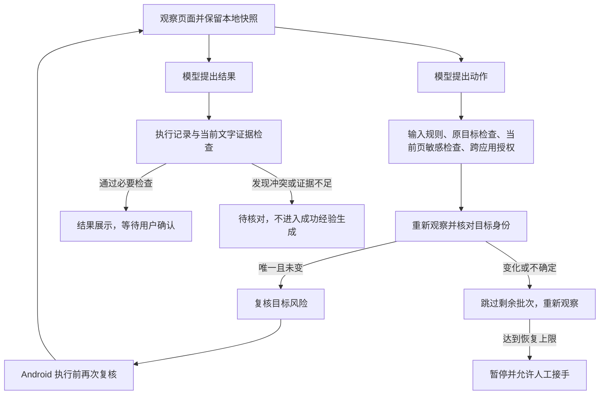

# 技术实现、创新性与应用价值评审及改进记录

日期：2026-10-04。基于本地代码和离线回归；省赛日期为 10 月 30 日。
本次重点审查并改进手机智能体的观察、动作执行、完成核验链路，未修改方案书中的历史实验数据。

## 评审判断

| 维度 | 代码体现出的基础 | 本次改进与判断 | 仍需的证据 |
| --- | --- | --- | --- |
| 技术实现 | Kotlin core 与 Android 执行层分开；已有重试、取消、交接、会话恢复和结果核验 | 修复观察与执行之间目标身份漂移、批量调用检查遗漏、动态页面过早耗尽修复预算等问题；提高可测试性 | 第三方 App 动态页面、键盘弹出、切换窗口和设备旋转的真机回归 |
| 创新性 | 有本地约束、模型规划和人工协作的组合设计 | 可展示的工程贡献是：观察来源绑定、执行前目标复核、按失败原因恢复、区分结果矛盾与证据不足 | 固定模型和安全词表的消融实验；目前不能凭规则数量或通过断言数认定原创算法突破 |
| 应用价值 | 语音办事、跨应用悬浮台、本人操作和家人接力对应明确需求 | 目标编号复用不再直接继承动作，页面抖动有独立恢复机会，人工交接后停止同批后续操作；预期减少误操作和不必要的求助 | 老年用户真实完成率、人工介入次数、结果理解程度、耗时与成本；本次未新增用户实测数据 |

## 已发现并修复的问题

| 优先级 | 原问题及影响 | 实现 |
| --- | --- | --- |
| P1 | 动作派发前重新读取页面，却把模型给出的旧控件编号与新页面直接结合；编号被复用时可能点击另一个控件 | `ToolCall` 携带本地观察快照；`ScreenActionGuard` 以原目标身份重新定位；core 与 Android 层在执行前各复核一次 |
| P1 | 批次只检查第一个 `open_app`，后续跨应用调用可能绕过目标授权；`open_settings` 缺少同类入口检查 | 检查批次内每个目的应用，设置入口采用同一确认规则；任一拒绝则本批不执行 |
| P1 | 模型在批次内请求交给本人、向用户提问或交给家人后，后续操作仍可能继续 | 终止本批后续动作，并为被跳过的调用补齐工具结果，保持对话协议合法 |
| P1 | 用界面文字节点数为包裹/订单数量背书，数字子串也可被当作依据，历史页面数字持续累积 | 去掉节点计数推断，按完整数字串匹配，引用不得跨节点拼接，只采用最新页面；包裹数、订单数、件数分别处理 |
| P2 | `stale_screen` 与参数错误共用很小的修复预算，页面动画可能直接导致任务暂停 | 页面失效单独计数，默认三次后暂停；每次重新观察并规划，成功的屏幕操作可清除此计数；总步数限制仍生效 |
| P2 | 没有可读文字时，核验返回 `Supported`，容易把“没有依据”理解为“已核验” | 新增 `Unverified`，和发现规则冲突的 `Unsupported` 分开；两者均进入现有待核对状态 |

相关代码：

- [AgentLoop](../core/src/main/kotlin/com/yinling/core/AgentLoop.kt)
- [ScreenActionGuard](../core/src/main/kotlin/com/yinling/core/ScreenActionGuard.kt)
- [ScreenAccessService](../app/src/main/java/com/yinling/hotline/ScreenAccessService.kt)
- [EvidenceCheck](../core/src/main/kotlin/com/yinling/core/EvidenceCheck.kt)
- [ManualActionPolicy](../core/src/main/kotlin/com/yinling/core/ManualActionPolicy.kt)

## 架构和功能变化



目标身份包含应用、窗口、尺寸，以及控件的文字、描述、角色、边界、能力、启用状态、资源标识、滑动条状态和可见的父子及同级上下文。编号变化但目标唯一且保持一致时才允许重新绑定。

坐标点按、滑动、焦点输入和粘贴仍要求页面版本一致。依靠未完整捕获的祖先接收点击的标签，不跨版本重新绑定。这里判断的是可观察到的局部控件一致性，不能证明业务对象一定相同。

把三种判断分开有助于说明设计：跨应用确认回答“用户是否允许去这里”，目标复核回答“还是刚才那个控件吗”，操作规则回答“这一步是否需要本人完成”。不能把它们全部描述成对不可逆后果的自动理解。

证据核验仅检查必要条件。`Supported` 不等于现实任务必然完成，也不代表结果文字每个字段都已获得语义证明。纯时间查询允许使用本地 `current_time` 工具结果，避免要求手机页面恰好显示时间。

现有 `SessionController` 已限制待核对任务的普通继续操作，并将其持久化；本次复用这个状态。只有任务完成、用户确认后才生成候选技巧，家人采纳后才启用；没有新增自动学习或自动发布技能的入口。

## 验证结果

执行命令：

```bash
./gradlew :core:test :app:assembleDebug --offline
ELDERHARNESS_OFFLINE=1 bash harness/run.sh
```

| 检查 | 本次结果 | 范围 |
| --- | --- | --- |
| core 单元及集成测试 | 47/47 通过，新增 29 项 | 目标编号漂移、同批页面切换、独立恢复预算、跨应用授权、人工交接、敏感页及键盘证据、时间查询等 |
| 离线 harness | 31 组场景，155/155 断言通过 | mock 提供方协议与已有功能、安全、核验回归；断言总数现由运行程序统计 |
| Android Debug | 构建成功 | Kotlin/Android 集成编译和 APK 打包 |
| 真机与用户验证 | 本轮未执行 | 不能把编译成功等同于真实第三方 App 流程验证 |

新增测试位于 `ScreenActionGuardTest`、`AgentLoopReliabilityTest` 和 `EvidenceCheckTest`。原有取消恢复和派发测试也通过。

完成核验沿用同一批 9 条人工标注样本，结果为：

| 策略 | 阻止错误结论直接完成（共 5 条） | 真实结果被判为无法确认（共 4 条） |
| --- | --- | --- |
| 无核验 | 0/5 | 0/4 |
| 仅机械核验 | 4/5 | 1/4 |
| 机械核验 + 历史证据原型 | 5/5 | 2/4 |
| 机械核验 + 本次证据核验 | 5/5 | 2/4 |

这组小样本表明新增核验有保守代价，不能写成“提高识别率且没有额外误伤”。本次修复的数字子串、重复节点、旧页面混入等缺陷由独立回归用例覆盖；它们与这 9 条对照样本不是同一个评测集合。

## 剩余限制与优先级

1. **字段与来源绑定**：普通数字仍可能来自页面上另一个字段；总数规则只识别有限表达，不能理解所有业务范围。下一步应把数量、取件码、日期分别绑定到字段、业务对象及来源快照，并验证提取器，不能直接信任模型自报的字段。
2. **视觉和多页证据**：本次收紧后，只有截图依据或需要跨页计算的正确结果也可能待核对。需要独立的视觉/结构化核验和有来源的跨页事实记录，才能在降低误确认的同时恢复这部分可用性。
3. **动作后果判断**：现有 F5 六项边界探针仍漏拦，包括关闭查找手机、允许安装未知应用、开启开发者选项、退出登录、更换手机号、关闭定位服务。155 条断言通过包含对该已知缺口的如实记录，不代表这些动作安全。
4. **技能验证**：`SkillWriter` 是候选技能总结器，尚没有独立任务集回放、候选版本对比和退化回滚闭环。可先做离线验证和人工采纳；“已实现自动自进化”仍缺少实现和实验支撑。
5. **核对体验**：待核对时目前显示解释并让用户查看原页面，尚缺少逐字段来源卡和明确的“已核对”反馈闭环。适老体验应通过用户测试决定，不能只追求拦截率。

## 省赛前最有价值的验证

以下均为建议实验，不是已完成结果。

### 固定条件的技术消融

固定模型版本、提示词、App 版本、初始状态、任务集和风险词表。分两项比较，每项只改变一个机制：

- 目标复核：整页版本一致才能执行，与本次唯一目标重新绑定比较。覆盖轮播、编号复用、列表换行、键盘弹出、弹窗及旋转；记录正确执行、误操作、暂停、恢复轮数和耗时。
- 完成核验：机械核验，与机械核验加当前证据核验比较。使用独立人工标注，记录错误完成率、真实完成被暂缓的比例、人工核对次数和端到端任务完成率。

将用于开发的回归样本与最终评测任务分开，保留全部失败和未知结果。现有 6/20 到 14/20 的词表对照只能证明覆盖范围扩展；它不能单独证明架构优势。

### 小规模适老验证

邀请 6 至 10 位老年参与者，选择三类低风险任务：查询一条快递的状态与取件码、调整字号、填写但不发送消息。对比自主操作、普通口头指导与本系统；采用等价任务并轮换顺序，降低熟悉操作造成的偏差。

每次记录实际任务完成、是否误以为完成、人工介入次数、总耗时、结果是否理解、失败后能否恢复，以及模型调用次数和实际调用费用。样本较小时先报告每人每任务的原始结果和分布，不据此外推市场普及率。

省赛展示优先保留三个可复现片段：动态页面下正确绑定目标、错误或无依据结果进入待核对、老人或家人接手后后续动作停止。它们分别对应可靠执行、结果可信和应用价值。
